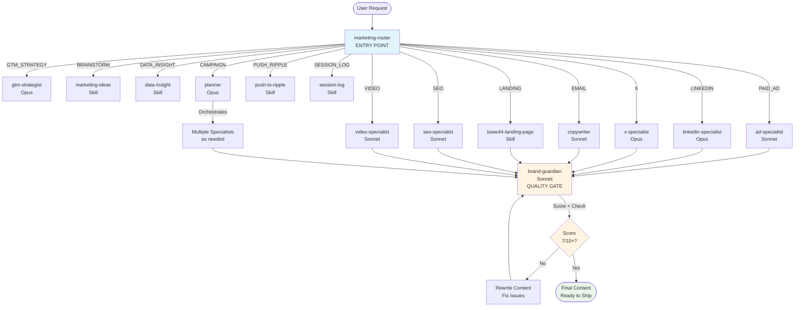

# Base44 Marketing Plugin

> Orchestrated content creation with 9 brand-aware agents, 20 specialized skills, and evolving memory.

## Installation

### Quick Install (Recommended)

```bash
/plugin install github:blutrich/base44-marketing-plugin
```

### Via Marketplace

```bash
# Add the marketplace (one-time)
/plugin marketplace add blutrich/base44-marketing-plugin

# Install the plugin
/plugin install base44-marketing@blutrich-base44-marketing-plugin
```

### Update to Latest

```bash
/plugin update base44-marketing
```

## Architecture

```
marketing-router (ENTRY POINT — open-ended, no menu)
        │
        ├── GTM_STRATEGY → gtm-strategist (deep exploration, then plan)
        ├── BRAINSTORM → marketing-ideas (connected narrative, not bullet dumps)
        ├── DATA_INSIGHT → data-insight (Trino analytics)
        ├── PAID_AD → ad-specialist → brand-guardian
        ├── LINKEDIN → linkedin-specialist → brand-guardian
        ├── X → x-specialist → brand-guardian
        ├── EMAIL → copywriter → brand-guardian
        ├── LANDING → base44-landing-page → brand-guardian
        ├── SEO → seo-specialist → brand-guardian
        ├── VIDEO → video-specialist → brand-guardian
        ├── PUSH_RIPPLE → push-to-ripple (content → Ripple CMS)
        ├── SESSION_LOG → session-log (usage tracking)
        └── CAMPAIGN → planner → [specialists] → brand-guardian
```

## Workflow Flowchart



## Skills (20)

| Skill | Purpose |
|-------|---------|
| `marketing-router` | Entry point - routes to workflows |
| `marketing-ideas` | 77+ tactics with playbooks |
| `marketing-psychology` | 71 persuasion principles |
| `linkedin-viral` | LinkedIn optimization |
| `x-viral` | X/Twitter optimization |
| `direct-response-copy` | THE SLIDE framework |
| `seo-content` | Search optimization |
| `geo-content` | AI citation (GEO) |
| `landing-page-architecture` | 8-Section Framework |
| `base44-landing-page` | HTML generation + Base44 hosting deployment |
| `base44-feature` | Pull product features for content |
| `hook-rules` | Anti-AI hook creation rules |
| `cross-platform-repurpose` | Content transformation |
| `brand-memory` | Persistent learning |
| `data-insight` | Trino analytics (growth, funnel, features) |
| `push-to-ripple` | Push content into Ripple CMS |
| `session-log` | Team usage tracking + ROI |
| `verification-before-delivery` | Quality assurance before output |
| `remotion` | Video creation in React |
| `nano-banana` | AI image generation (Imagen 3) |

## Agents (9)

| Agent | Model | Purpose |
|-------|-------|---------|
| `gtm-strategist` | Opus | Deep strategic planning |
| `ad-specialist` | Sonnet | Paid ads (Meta, LinkedIn, Reddit) |
| `linkedin-specialist` | Opus | Viral LinkedIn content |
| `x-specialist` | Opus | X/Twitter content |
| `copywriter` | Sonnet | Emails, landing pages |
| `seo-specialist` | Sonnet | Blog, SEO content |
| `video-specialist` | Sonnet | Remotion videos + AI imagery |
| `planner` | Opus | Multi-channel campaigns |
| `brand-guardian` | Sonnet | Quality gate (scores + rewrites) |

## Usage

```bash
# LinkedIn post
Create a LinkedIn post about our new AI feature

# X/Twitter thread
Write a thread about the $1M ARR milestone

# Paid ad
Create a Meta feed ad for our AI feature

# Brainstorm ideas
I need marketing ideas to amplify our product launch

# Full campaign
Plan a multi-channel campaign for our native app launch
```

## Brand Voice

**BUILDER-FIRST | FAST-PACED | RESULTS-FOCUSED**

| USE | AVOID |
|-----|-------|
| "Builders" | "Users" / "Customers" |
| "Ship" / "Go live" | "Deploy" / "Launch" |
| "Vibe coding" | "No-code" alone |
| "Just shipped" | "We're excited to announce" |
| Action verbs, present tense | Passive voice |

## Hook Styles (5 Approved)

1. **Result-First**: Lead with outcome ("$350K saved. One app.")
2. **Builder Spotlight**: Feature a person ("Sarah launched her SaaS yesterday")
3. **Possibility Hook**: "What if..." questions
4. **Social Proof**: Numbers showing momentum ("12 apps launched this week")
5. **Direct Value**: Clear benefit in one line ("Your app can now send emails — test mode included")

## Memory System

### Plugin Core (versioned)
```
skills/         # Skill definitions
agents/         # Agent configs
brands/base44/  # Brand guidelines
```

### User Memory (preserved on updates)
```
~/.claude/marketing/
├── activeContext.md    # Current focus
├── patterns.md         # What works
├── feedback.md         # Pending reviews
└── learning-log.md     # Team feedback
```

## File Structure

```
base44-marketing-plugin/
├── .claude-plugin/
│   └── plugin.json         # Plugin metadata
├── CLAUDE.md               # Plugin instructions
├── README.md               # This file
├── test-plugin.sh          # E2E validation (147 tests)
├── skills/
│   ├── marketing-router/
│   ├── marketing-ideas/
│   ├── marketing-psychology/
│   ├── linkedin-viral/
│   ├── x-viral/
│   ├── direct-response-copy/
│   ├── seo-content/
│   ├── geo-content/
│   ├── landing-page-architecture/
│   ├── base44-landing-page/
│   ├── base44-feature/
│   ├── hook-rules/
│   ├── cross-platform-repurpose/
│   ├── brand-memory/
│   ├── data-insight/
│   ├── push-to-ripple/
│   ├── session-log/
│   ├── verification-before-delivery/
│   ├── remotion/
│   └── nano-banana/
├── agents/
│   ├── shared-instructions.md  # Common voice rules (all agents read this)
│   ├── gtm-strategist.md
│   ├── ad-specialist.md
│   ├── linkedin-specialist.md
│   ├── x-specialist.md
│   ├── copywriter.md
│   ├── seo-specialist.md
│   ├── video-specialist.md
│   ├── planner.md
│   └── brand-guardian.md
└── brands/
    └── base44/
        ├── RULES.md            # 21 NEVER + 9 ALWAYS rules
        ├── tone-of-voice.md
        ├── banned-words.md     # 130+ banned AI words/phrases
        ├── learning-log.md
        └── templates/
```

## Anti-AI Patterns

Full banned word list in `brands/base44/banned-words.md` (130+ words/phrases).

**DON'T:**
- Use banned AI words (delve, leverage, landscape, harness, etc.)
- Stack declarative fragments ("Build faster. Ship smarter. Scale infinitely.")
- Use rule-of-three patterns ("The platform. The community. The future.")
- Overuse em dashes (1-2 per post max)
- Start consecutive paragraphs the same way
- Use emoji as bullet points
- Write anything that sounds like a TV commercial voiceover

**DO:**
- Natural sentence flow with varied structure
- Conversational tone (Maor's Slack huddle voice)
- Specific numbers and builder stories
- Occasional imperfection is fine
- Pass the Maor Test: Would Maor post this exactly as written?

## Testing

```bash
bash test-plugin.sh
# 147 tests: structure, agents, skills, brands, cross-file integrity, E2E validation
```

---

*Version 1.9.0 | Router → Agent Chains → Quality Gate*
