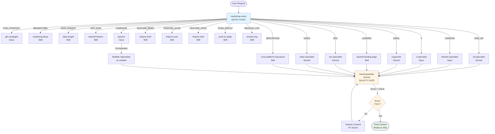

# Base44 Marketing Plugin

> Orchestrated content creation with 9 brand-aware agents, 23 specialized skills, and evolving memory.

## Installation

### Quick Install (Recommended)

```bash
/plugin install github:blutrich/base44-marketing-plugin
```

### Via Marketplace

```bash
# Add the marketplace (one-time)
/plugin marketplace add blutrich/base44-marketing-plugin

# Install the plugin
/plugin install base44-marketing@blutrich-base44-marketing-plugin
```

### Update to Latest

```bash
/plugin update base44-marketing
```

## Architecture

```
marketing-router (ENTRY POINT — open-ended, no menu)
        │
        ├── GTM_STRATEGY → gtm-strategist (deep exploration, then plan)
        ├── BRAINSTORM → marketing-ideas (connected narrative, not bullet dumps)
        ├── DATA_INSIGHT → data-insight (Trino analytics) → gtm-strategist (if strategy)
        ├── APP_DATA → base44-feature (pull product features)
        ├── PAID_AD → ad-specialist → brand-guardian
        ├── LINKEDIN → linkedin-specialist → brand-guardian
        ├── X → x-specialist → brand-guardian
        ├── EMAIL → copywriter → brand-guardian
        ├── LANDING → base44-landing-page (8-Section → HTML → Base44 CLI deploy) → brand-guardian
        ├── SEO → seo-specialist → brand-guardian
        ├── VIDEO → video-specialist → brand-guardian
        ├── REPURPOSE → cross-platform-repurpose → brand-guardian
        ├── PUSH_RIPPLE → push-to-ripple (content → Ripple CMS)
        ├── FEATURE_BRIEF → feature-brief (Feature → Slack → MarketingActivity)
        ├── FEATURE_SCAN → feature-scan (scan channel → check Ripple → brief + content → push)
        ├── FEATURE_INTEL → feature-intel (scan #feat-* → detect new → digest to Slack)
        ├── SESSION_LOG → session-log (usage tracking → Base44 PluginSession)
        └── CAMPAIGN → planner → [specialists in parallel] → brand-guardian
```

## Workflow Flowchart


```mermaid
flowchart TD
    Start([User Request]) --> Router[marketing-router<br/>ENTRY POINT]

    Router -->|GTM_STRATEGY| GTMAgent[gtm-strategist<br/>Opus]
    Router -->|BRAINSTORM| BrainstormSkill[marketing-ideas<br/>Skill]
    Router -->|DATA_INSIGHT| DataSkill[data-insight<br/>Skill]
    Router -->|APP_DATA| FeatureSkill[base44-feature<br/>Skill]
    Router -->|PAID_AD| AdAgent[ad-specialist<br/>Sonnet]
    Router -->|LINKEDIN| LinkedInAgent[linkedin-specialist<br/>Opus]
    Router -->|X| XAgent[x-specialist<br/>Opus]
    Router -->|EMAIL| CopyAgent1[copywriter<br/>Sonnet]
    Router -->|LANDING| LandingSkill[base44-landing-page<br/>Skill]
    Router -->|SEO| SEOAgent[seo-specialist<br/>Sonnet]
    Router -->|VIDEO| VideoAgent[video-specialist<br/>Sonnet]
    Router -->|REPURPOSE| RepurposeSkill[cross-platform-repurpose<br/>Skill]
    Router -->|CAMPAIGN| PlannerAgent[planner<br/>Opus]
    Router -->|FEATURE_BRIEF| FeatureBrief[feature-brief<br/>Skill]
    Router -->|FEATURE_SCAN| FeatureScan[feature-scan<br/>Skill]
    Router -->|FEATURE_INTEL| FeatureIntel[feature-intel<br/>Skill]
    Router -->|PUSH_RIPPLE| RippleSkill[push-to-ripple<br/>Skill]
    Router -->|SESSION_LOG| SessionSkill[session-log<br/>Skill]

    AdAgent --> Guardian[brand-guardian<br/>Sonnet<br/>QUALITY GATE]
    LinkedInAgent --> Guardian
    XAgent --> Guardian
    CopyAgent1 --> Guardian
    LandingSkill --> Guardian
    SEOAgent --> Guardian
    VideoAgent --> Guardian
    RepurposeSkill --> Guardian
    PlannerAgent -->|Orchestrates| MultiAgent[Multiple Specialists<br/>as needed]
    MultiAgent --> Guardian

    Guardian -->|Score + Check| BrandCheck{Score<br/>7/10+?}
    BrandCheck -->|No| Rewrite[Rewrite Content<br/>Fix Issues]
    Rewrite --> Guardian
    BrandCheck -->|Yes| Output([Final Content<br/>Ready to Ship])

    style Router fill:#e1f5ff
    style Guardian fill:#fff4e1
    style Output fill:#e8f5e9
    style BrandCheck fill:#fff4e1
```

## Skills (23)

### Content Creation

| Skill | Purpose |
|-------|---------|
| `marketing-router` | Entry point — routes to workflows |
| `linkedin-viral` | LinkedIn optimization patterns |
| `x-viral` | X/Twitter optimization patterns |
| `direct-response-copy` | THE SLIDE framework for conversion copy |
| `seo-content` | Search optimization |
| `geo-content` | AI citation optimization (ChatGPT, Perplexity, Claude) |
| `landing-page-architecture` | Copy Brief + 8-Section Framework |
| `base44-landing-page` | HTML generation + Base44 hosting deployment |
| `cross-platform-repurpose` | Transform content between platforms |

### Ideation & Strategy

| Skill | Purpose |
|-------|---------|
| `marketing-ideas` | 77+ tactics with playbooks |
| `marketing-psychology` | 71 persuasion principles |
| `hook-rules` | Approved hook styles + banned patterns |

### Product Intelligence

| Skill | Purpose |
|-------|---------|
| `base44-feature` | Pull product features from Base44 App API |
| `feature-brief` | Single-feature deep dive: Slack → MarketingActivity |
| `feature-scan` | Batch scanner: #product-marketing-sync → Ripple |
| `feature-intel` | Intel scan: #feat-* channels → digest to Slack. Works with `/loop 12h` |
| `data-insight` | Trino analytics: growth, models, funnel, apps, features, remix, referrals, monetization, user voice (19 queries, 6 tables) |

### Infrastructure

| Skill | Purpose |
|-------|---------|
| `push-to-ripple` | Push content into Ripple CMS |
| `session-log` | Team usage tracking + ROI via Base44 PluginSession entity |
| `brand-memory` | Persistent learning across sessions |
| `verification-before-delivery` | Quality assurance before output |
| `remotion` | Video creation in React (24 sub-rule files) |
| `nano-banana` | AI image generation via Google Imagen 3 |

## Agents (9)

| Agent | Model | Purpose |
|-------|-------|---------|
| `gtm-strategist` | Opus | Deep strategic planning (explore first, plan holistically) |
| `ad-specialist` | Sonnet | Paid ads (Meta, LinkedIn, Reddit) |
| `linkedin-specialist` | Opus | Viral LinkedIn content |
| `x-specialist` | Opus | X/Twitter content |
| `copywriter` | Sonnet | Emails, landing pages, conversion copy |
| `seo-specialist` | Sonnet | Blog posts, SEO/GEO content |
| `video-specialist` | Sonnet | Remotion videos + AI imagery |
| `planner` | Opus | Multi-channel campaigns |
| `brand-guardian` | Sonnet | Quality gate (18-item scoring checklist + rewrites) |

All content agents read `agents/shared-instructions.md` before generating. Brand-guardian runs an 18-item checklist covering vocabulary, structure, anti-AI patterns, channel fit, and the Maor Test.

## Usage

Just ask in plain English. The plugin context is always loaded.

```bash
# LinkedIn post
Create a LinkedIn post about our new AI feature

# X/Twitter thread
Write a thread about the $100M ARR milestone

# Paid ad
Create a Meta feed ad for Base44 Agents

# Strategy
Help me think through our go-to-market for Agents launch

# Brainstorm
I need marketing ideas to amplify our product launch

# Full campaign
Plan a multi-channel campaign for our native app launch

# Landing page
Build a landing page for Debug Mode and deploy it

# Feature intelligence
Scan feat channels for new features

# Analytics
Show me growth numbers and turn them into a post

# Push to CMS
Push this to Ripple
```

## Brand Voice

**BUILDER-FIRST | FAST-PACED | RESULTS-FOCUSED**

| USE | AVOID |
|-----|-------|
| "Builders" | "Users" / "Customers" |
| "Ship" / "Go live" | "Deploy" / "Launch" |
| "Vibe coding" | "No-code" alone |
| "Just shipped" | "We're excited to announce" |
| Action verbs, present tense | Passive voice |
| Specific numbers | Vague claims |
| Short paragraphs | Walls of text |

## Anti-AI Patterns

Full banned word list in `brands/base44/banned-words.md` (130+ words/phrases).

**DON'T:**
- Use banned AI words (delve, leverage, landscape, harness, etc.)
- Stack declarative fragments ("Build faster. Ship smarter. Scale infinitely.")
- Stack short sentences for dramatic effect (three or more in a row)
- Use contrast framing ("It's not X, it's Y" or "No X, no Y, just Z")
- Use rule-of-three patterns (two is fine, four is fine, three every time is AI)
- Use em dashes (zero tolerance — biggest AI tell in 2026)
- Start consecutive paragraphs the same way
- Use emoji as bullet points
- Write anything that sounds like a TV commercial voiceover
- Self-narrate ("Here's why this matters", "The key takeaway is")

**DO:**
- Natural sentence flow with varied structure
- Conversational tone (Maor's Slack huddle voice)
- Specific numbers and builder stories
- Leave some imperfection (fragments, asides, half-thoughts OK)
- Have opinions, show mixed feelings
- Pass the Maor Test: Would Maor post this exactly as written?

## Hook Styles (5 Approved)

1. **Result-First**: Lead with outcome ("$350K saved. One app.")
2. **Builder Spotlight**: Feature a person ("A flooring sales rep cut quote time from 2 days to 3 hours")
3. **Possibility Hook**: "What if..." questions
4. **Social Proof**: Numbers showing momentum ("12 apps shipped this week")
5. **Direct Value**: Clear benefit in one line ("Your app can now send emails, test mode included")

## Memory System

### Plugin Core (versioned)
```
skills/         # 23 skill definitions
agents/         # 9 agent configs + shared-instructions.md
brands/base44/  # Brand guidelines, rules, banned words, design system
```

### User Memory (preserved on updates)
```
~/.claude/marketing/
├── activeContext.md    # Current focus
├── patterns.md        # What works
└── feedback.md        # Pending reviews
```

## File Structure

```
base44-marketing-plugin/
├── .claude-plugin/
│   ├── plugin.json            # Plugin metadata (v1.12.0)
│   ├── settings.json          # Permissions + env vars
│   └── hooks.json             # TeammateIdle, Stop, PostToolUse hooks
├── CLAUDE.md                  # Plugin instructions for Claude
├── PLUGIN-DESCRIPTION.md      # Short description
├── README.md                  # This file
├── skills/
│   ├── marketing-router/      # Entry point + reference files
│   ├── marketing-ideas/       # Tactics + 5 playbooks
│   ├── marketing-psychology/  # 71 principles
│   ├── linkedin-viral/
│   ├── x-viral/
│   ├── direct-response-copy/
│   ├── seo-content/
│   ├── geo-content/
│   ├── landing-page-architecture/
│   ├── base44-landing-page/   # HTML gen + deploy templates
│   ├── base44-feature/
│   ├── feature-brief/         # Single-feature deep dive
│   ├── feature-scan/          # Batch scanner
│   ├── feature-intel/         # Intel discovery + known-channels.md
│   ├── hook-rules/
│   ├── cross-platform-repurpose/
│   ├── brand-memory/
│   ├── data-insight/          # 19 Trino queries, 6 tables
│   ├── push-to-ripple/
│   ├── session-log/
│   ├── verification-before-delivery/
│   ├── remotion/              # 24 sub-rule files
│   └── nano-banana/
├── agents/
│   ├── shared-instructions.md # Common voice rules (all agents read this)
│   ├── gtm-strategist.md
│   ├── ad-specialist.md
│   ├── linkedin-specialist.md
│   ├── x-specialist.md
│   ├── copywriter.md
│   ├── seo-specialist.md
│   ├── video-specialist.md
│   ├── planner.md
│   └── brand-guardian.md      # 18-item scoring checklist
├── brands/
│   └── base44/
│       ├── RULES.md           # 38 NEVER + 14 ALWAYS rules
│       ├── tone-of-voice.md   # Full voice guide with Maor examples
│       ├── banned-words.md    # 130+ banned AI words/phrases
│       ├── brand.json         # Design tokens (colors, fonts, spacing)
│       ├── design-system.md   # HTML/CSS/React component library
│       ├── brand-system.md    # Brand system overview
│       ├── guidelines.md
│       ├── learning-log.md    # Feedback patterns + promotion thresholds
│       ├── campaigns/
│       ├── case-studies/
│       ├── content-library/   # CTAs, hooks, value props, objections, guerrilla playbook
│       ├── facts/metrics.md   # Company stats for social proof
│       ├── feedback/          # Anonymized testimonials, personas, pain points
│       └── templates/         # Channel templates (LinkedIn, X, Discord, Email, What's New)
├── teams/                     # Agent Teams workflow templates
├── hooks/                     # teammate-idle.sh
└── docs/
    ├── plans/                 # Saved plans
    └── research/              # Saved research
```

## Agent Teams Support

The plugin supports Claude Code Agent Teams for parallel content creation:

| Template | When |
|----------|------|
| `campaign-launch` | Multi-channel campaign with 3+ channels |
| `content-sprint` | Batch content creation ("week of content") |
| `brand-audit` | Full brand consistency review |
| `ab-testing` | A/B variant generation |

Teams are spawned automatically when the router detects the right signals, or you can request them directly.

## Testing

```bash
bash test-plugin.sh
# Structure, agents, skills, brands, cross-file integrity, E2E validation
```

---

*Version 1.13.0 | 9 Agents | 23 Skills | 38+14 Brand Rules | Router → Agent Chains → Quality Gate*
