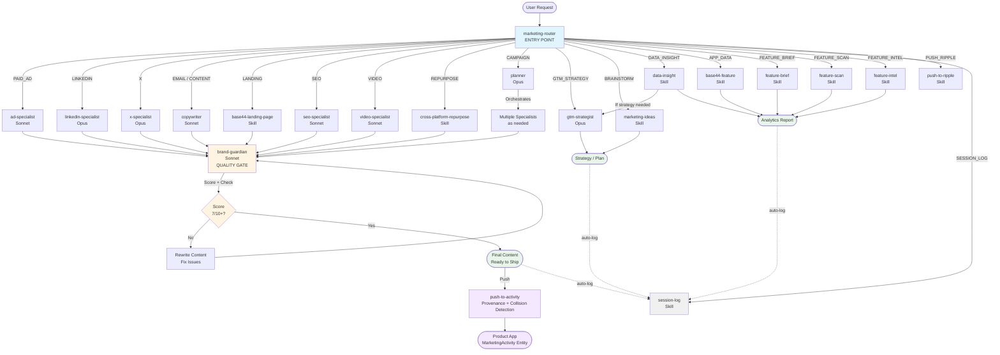

# Base44 Marketing Plugin

> Orchestrated content creation with 9 brand-aware agents, 25+ specialized skills, persistent memory, and a full MarketingActivity CI/CD pipeline.

## Installation

### Quick Install (Recommended)

```bash
/plugin install github:blutrich/base44-marketing-plugin
```

### Via Marketplace

```bash
# Add the marketplace (one-time)
/plugin marketplace add blutrich/base44-marketing-plugin

# Install the plugin
/plugin install base44-marketing@blutrich-base44-marketing-plugin
```

### Update to Latest

```bash
/plugin update base44-marketing
```

## Architecture

```
marketing-router (ENTRY POINT — open-ended, no menu)
        │
        │── CONTENT WORKFLOWS (→ brand-guardian quality gate)
        │   ├── PAID_AD → ad-specialist → brand-guardian
        │   ├── LINKEDIN → linkedin-specialist → brand-guardian
        │   ├── X → x-specialist → brand-guardian
        │   ├── EMAIL / CONTENT → copywriter → brand-guardian
        │   ├── LANDING → base44-landing-page → brand-guardian
        │   ├── SEO → seo-specialist → brand-guardian
        │   ├── VIDEO → video-specialist → brand-guardian
        │   ├── REPURPOSE → cross-platform-repurpose → brand-guardian
        │   └── CAMPAIGN → planner → [specialists in parallel] → brand-guardian
        │
        │── STRATEGY WORKFLOWS (no guardian — plans, not content)
        │   ├── GTM_STRATEGY → gtm-strategist (deep exploration, then plan)
        │   └── BRAINSTORM → marketing-ideas (connected narrative, not bullet dumps)
        │
        │── DATA & INTELLIGENCE (no guardian — data pipelines)
        │   ├── DATA_INSIGHT → data-insight (Trino analytics) → gtm-strategist (if strategy)
        │   ├── APP_DATA → base44-feature (pull product features)
        │   ├── FEATURE_BRIEF → feature-brief (Feature → Slack → MarketingActivity)
        │   ├── FEATURE_SCAN → feature-scan (batch: channel → Ripple → notify)
        │   └── FEATURE_INTEL → feature-intel (#feat-* → detect new → digest)
        │
        │── MARKETING ACTIVITY PIPELINE (provenance + collision detection)
        │   ├── PUSH_ACTIVITY → push-to-activity (content → MarketingActivity entity)
        │   └── PUSH_RIPPLE → push-to-ripple (content → Ripple CMS)
        │
        └── INFRASTRUCTURE
            ├── SESSION_LOG → session-log (auto after every workflow)
            └── BRAND_MEMORY → brand-memory (persistent learning)
```

## Workflow Flowchart


```mermaid
flowchart TD
    Start([User Request]) --> Router[marketing-router<br/>ENTRY POINT]

    %% Content workflows (go through brand-guardian)
    Router -->|PAID_AD| AdAgent[ad-specialist<br/>Sonnet]
    Router -->|LINKEDIN| LinkedInAgent[linkedin-specialist<br/>Opus]
    Router -->|X| XAgent[x-specialist<br/>Opus]
    Router -->|EMAIL / CONTENT| CopyAgent1[copywriter<br/>Sonnet]
    Router -->|LANDING| LandingSkill[base44-landing-page<br/>Skill]
    Router -->|SEO| SEOAgent[seo-specialist<br/>Sonnet]
    Router -->|VIDEO| VideoAgent[video-specialist<br/>Sonnet]
    Router -->|REPURPOSE| RepurposeSkill[cross-platform-repurpose<br/>Skill]
    Router -->|CAMPAIGN| PlannerAgent[planner<br/>Opus]

    AdAgent --> Guardian[brand-guardian<br/>Sonnet<br/>QUALITY GATE]
    LinkedInAgent --> Guardian
    XAgent --> Guardian
    CopyAgent1 --> Guardian
    LandingSkill --> Guardian
    SEOAgent --> Guardian
    VideoAgent --> Guardian
    RepurposeSkill --> Guardian
    PlannerAgent -->|Orchestrates| MultiAgent[Multiple Specialists<br/>as needed]
    MultiAgent --> Guardian

    Guardian -->|Score + Check| BrandCheck{Score<br/>7/10+?}
    BrandCheck -->|No| Rewrite[Rewrite Content<br/>Fix Issues]
    Rewrite --> Guardian
    BrandCheck -->|Yes| Output([Final Content<br/>Ready to Ship])

    %% Strategy workflows (no brand-guardian)
    Router -->|GTM_STRATEGY| GTMAgent[gtm-strategist<br/>Opus]
    Router -->|BRAINSTORM| BrainstormSkill[marketing-ideas<br/>Skill]
    GTMAgent --> StrategyOut([Strategy / Plan])
    BrainstormSkill --> StrategyOut

    %% Data & intelligence workflows (no brand-guardian)
    Router -->|DATA_INSIGHT| DataSkill[data-insight<br/>Skill]
    DataSkill -->|If strategy needed| GTMAgent
    DataSkill --> DataOut([Analytics Report])
    Router -->|APP_DATA| FeatureSkill[base44-feature<br/>Skill]
    Router -->|FEATURE_BRIEF| FeatureBrief[feature-brief<br/>Skill]
    Router -->|FEATURE_SCAN| FeatureScan[feature-scan<br/>Skill]
    Router -->|FEATURE_INTEL| FeatureIntel[feature-intel<br/>Skill]
    FeatureSkill --> DataOut
    FeatureBrief --> DataOut
    FeatureScan --> DataOut
    FeatureIntel --> DataOut

    %% MarketingActivity pipeline
    Output -->|Push| PushActivity[push-to-activity<br/>Provenance + Collision Detection]
    PushActivity --> ProductApp([Product App<br/>MarketingActivity Entity])

    %% Infrastructure workflows
    Router -->|PUSH_RIPPLE| RippleSkill[push-to-ripple<br/>Skill]
    Router -->|SESSION_LOG| SessionSkill[session-log<br/>Skill]

    %% Auto session logging (every workflow)
    Output -.->|auto-log| SessionSkill
    StrategyOut -.->|auto-log| SessionSkill
    DataOut -.->|auto-log| SessionSkill

    style Router fill:#e1f5ff
    style Guardian fill:#fff4e1
    style Output fill:#e8f5e9
    style StrategyOut fill:#e8f5e9
    style DataOut fill:#e8f5e9
    style ProductApp fill:#f3e8ff
    style BrandCheck fill:#fff4e1
    style SessionSkill fill:#f0f0f0
    style PushActivity fill:#f3e8ff
```

## MarketingActivity Pipeline (v1.18.0)

Every push to the Product App now includes:

### Provenance Tracking
Every content push records who created it, how, and when:
- `created_by_user` — email or name
- `created_by_tool` — "Marketing Plugin v1.18.1"
- `generation_method` — `ai_generated` / `ai_assisted` / `human_written`
- `pushed_at` — ISO timestamp
- `content_maturity` — `raw_draft` → `reviewed_draft` → `pmm_approved` → `final`
- `edit_history` — git-style changelog array

### Collision Detection
When pushing content to an existing MarketingActivity, the plugin checks whether target channels already have content:
- **No collision** (empty slots only): auto-fills, no prompt
- **Collision detected**: asks user to Replace / Create v2 / Cancel
- Old content is saved to `channel_version_history` before overwrite

### Activity Numbering
Every new MarketingActivity gets a sequential `activity_number` (MA-1, MA-2...) for human-readable tracking. Numbers are never changed on updates.

### Brief Fields
When pushing from a launch waterfall, 12 `brief_*` fields are populated from Phase 1-3 outputs (product summary, pain points, proof points, primary message, H1 options, story beats, etc.).

### Three Entry Points
| Entry Point | Mode | Collision Behavior |
|-------------|------|-------------------|
| `push-to-activity` | Interactive (standalone or waterfall Phase 7) | Ask user: Replace / Create v2 / Cancel |
| `feature-brief` | Interactive (single feature) | Same as above |
| `feature-scan` | Batch (multiple features) | Fill empty only, log skips |

## Skills (25)

### Content Creation

| Skill | Purpose |
|-------|---------|
| `marketing-router` | Entry point — routes to workflows |
| `shared-instructions` | Core voice rules, injected into all agents at startup via `skills` field |
| `linkedin-viral` | LinkedIn optimization patterns |
| `x-viral` | X/Twitter optimization patterns |
| `direct-response-copy` | THE SLIDE framework for conversion copy |
| `seo-content` | Search optimization |
| `geo-content` | AI citation optimization (ChatGPT, Perplexity, Claude) |
| `landing-page-architecture` | Copy Brief + 8-Section Framework |
| `base44-landing-page` | HTML generation + Base44 hosting deployment |
| `cross-platform-repurpose` | Transform content between platforms |

### Ideation & Strategy

| Skill | Purpose |
|-------|---------|
| `marketing-ideas` | 77+ tactics with playbooks |
| `marketing-psychology` | 71 persuasion principles |
| `hook-rules` | 6 approved hook styles + banned patterns |

### Product Intelligence

| Skill | Purpose |
|-------|---------|
| `base44-feature` | Pull product features from Base44 App API |
| `feature-brief` | Single-feature deep dive: Slack → MarketingActivity |
| `feature-scan` | Batch scanner: #product-marketing-sync → Ripple. Works with `/loop 30m` |
| `feature-intel` | Intel scan: #feat-* channels → digest to Slack. Works with `/loop 12h` |
| `data-insight` | Trino analytics: growth, models, funnel, apps, features, remix, referrals, monetization, user voice (19 queries, 6 tables) |

### Infrastructure

| Skill | Purpose |
|-------|---------|
| `push-to-activity` | Push content → MarketingActivity entity with provenance, collision detection, activity numbering |
| `push-to-ripple` | Push content into Ripple CMS |
| `session-log` | Team usage tracking + ROI via Base44 PluginSession entity |
| `brand-memory` | Persistent learning across sessions |
| `verification-before-delivery` | Quality assurance before output |
| `remotion` | Video creation in React (24 sub-rule files) |
| `nano-banana` | AI image generation via Google Imagen 3 |

## Agents (9)

| Agent | Model | Memory | Purpose |
|-------|-------|--------|---------|
| `gtm-strategist` | Opus | `project` | Deep strategic planning (explore first, plan holistically) |
| `ad-specialist` | Sonnet | — | Paid ads (Meta, LinkedIn, Reddit) |
| `linkedin-specialist` | Opus | — | Viral LinkedIn content |
| `x-specialist` | Opus | — | X/Twitter content |
| `copywriter` | Sonnet | — | Emails, landing pages, conversion copy |
| `seo-specialist` | Sonnet | — | Blog posts, SEO/GEO content |
| `video-specialist` | Sonnet | — | Remotion videos + AI imagery |
| `planner` | Opus | — | Multi-channel campaigns |
| `brand-guardian` | Sonnet | `project` | Quality gate (18-item scoring checklist + rewrites) |

All agents get `shared-instructions` injected via the `skills` frontmatter field at startup (guaranteed context, no Read() needed). Brand-guardian runs an 18-item checklist covering vocabulary, structure, anti-AI patterns, channel fit, visual quality, and the Maor Test.

Agents with `memory: project` persist learnings across sessions in `.claude/agent-memory/<name>/`.

## Launch Waterfall (8 Phases)

```
Phase 0: AUTO-DISCOVERY     (feature-intel detects new features)
Phase 1: PRODUCT UNDERSTANDING (product brief, target segments)
Phase 2: PAIN + POSITIONING    (pain points, proof, competitive)
Phase 3: MESSAGING FRAMEWORK   (primary message, H1 options, story beats)
Phase 4: ASSET PLANNING         (planner maps channels, dependencies)
Phase 5: ASSET CREATION         (specialists in parallel → brand-guardian)
Phase 6: LAUNCH EXECUTION       (checklist, teaser cadence)
Phase 7: PUSH TO PRODUCT APP    (push-to-activity with provenance)
```

Each phase produces a specific deliverable that gates the next. No skipping.

## Usage

Just ask in plain English. The plugin context is always loaded.

```bash
# LinkedIn post
Create a LinkedIn post about our new AI feature

# X/Twitter thread
Write a thread about the $100M ARR milestone

# Paid ad
Create a Meta feed ad for Base44 Agents

# Strategy
Help me think through our go-to-market for Agents launch

# Brainstorm
I need marketing ideas to amplify our product launch

# Full campaign
Plan a multi-channel campaign for our native app launch

# Landing page
Build a landing page for Debug Mode and deploy it

# Feature intelligence
Scan feat channels for new features

# Analytics
Show me growth numbers and turn them into a post

# Push to Product App
Push this to the marketing activity

# Push to CMS
Push this to Ripple
```

## Brand Voice

**BUILDER-FIRST | FAST-PACED | RESULTS-FOCUSED | SHOW-DON'T-TELL**

| USE | AVOID |
|-----|-------|
| "Builders" | "Users" / "Customers" |
| "Ship" / "Go live" | "Deploy" / "Launch" |
| "Just shipped" | "We're excited to announce" |
| Action verbs, present tense | Passive voice |
| Specific numbers | Vague claims |
| Short paragraphs | Walls of text |
| Commas, periods | Em dashes (zero tolerance) |

## Anti-AI Patterns

Full banned word list in `brands/base44/banned-words.md` (130+ words/phrases).

**DON'T:**
- Use banned AI words (delve, leverage, landscape, harness, etc.)
- Stack declarative fragments ("Build faster. Ship smarter. Scale infinitely.")
- Stack 3+ short sentences for dramatic effect
- Use contrast framing ("It's not X, it's Y" or "No X, no Y, just Z")
- Use rule-of-three patterns (two or four+, never three)
- Use em dashes (biggest AI tell in 2026)
- Self-narrate ("Here's why this matters", "The key takeaway is")
- Write anything that sounds like a TV commercial voiceover

**DO:**
- Natural sentence flow with varied structure
- Conversational tone (Maor's Slack huddle voice)
- Specific numbers and builder stories
- Leave some imperfection (fragments, asides OK)
- Have opinions, show mixed feelings
- Pass the Maor Test: Would Maor post this exactly as written?

## Hook Styles (6 Approved)

1. **Result-First**: Lead with outcome ("$350K saved. One app.")
2. **Builder Spotlight**: Feature a person ("A flooring sales rep cut quote time from 2 days to 3 hours")
3. **Possibility Hook**: "What if..." questions
4. **Social Proof**: Numbers showing momentum ("12 apps shipped this week")
5. **Direct Value**: Clear benefit in one line ("Your app can now send emails, test mode included")
6. **Hormozi Formula**: Outcome + timeframe + without objection ("Build a full-stack app in 20 minutes without writing a line of code")

## Agent Teams Support

The plugin supports Claude Code Agent Teams for parallel content creation:

| Template | When |
|----------|------|
| `campaign-launch` | Multi-channel campaign with 3+ channels |
| `content-sprint` | Batch content creation ("week of content") |
| `brand-audit` | Full brand consistency review |
| `ab-testing` | A/B variant generation |

Teams are spawned automatically when the router detects the right signals, or you can request them directly.

## Memory System

### Plugin Core (versioned)
```
skills/         # 25 skill definitions
agents/         # 9 agent configs + shared-instructions.md (backward compat)
brands/base44/  # Brand guidelines, rules, banned words, design system
```

### Agent Memory (persistent across sessions)
```
.claude/agent-memory/brand-guardian/    # Quality patterns, recurring issues
.claude/agent-memory/gtm-strategist/   # Campaign decisions, strategic context
```

### User Memory (preserved on updates)
```
.claude/marketing/
├── activeContext.md    # Current focus
├── patterns.md        # What works
├── feedback.md        # Pending reviews
└── sessions.md        # Session log (auto-appended)
```

## File Structure

```
base44-marketing-plugin/
├── .claude-plugin/
│   └── plugin.json             # Plugin metadata (v1.18.0) — ONLY file here
├── settings.json               # Permissions + env vars (at plugin ROOT)
├── hooks/
│   ├── hooks.json              # Agent, Stop, TeammateIdle hooks
│   ├── session-end.sh
│   └── teammate-idle.sh
├── CLAUDE.md                   # Plugin instructions for Claude
├── README.md                   # This file
├── skills/
│   ├── shared-instructions/    # Core voice rules (injected into all agents)
│   ├── marketing-router/       # Entry point + reference files
│   ├── marketing-ideas/        # Tactics + 5 playbooks
│   ├── marketing-psychology/   # 71 principles + 4 reference files
│   ├── linkedin-viral/
│   ├── x-viral/
│   ├── direct-response-copy/
│   ├── seo-content/
│   ├── geo-content/
│   ├── landing-page-architecture/ # Copy brief + 8-section framework
│   ├── base44-landing-page/    # HTML gen + deploy templates
│   ├── base44-feature/
│   ├── feature-brief/          # Single-feature deep dive
│   ├── feature-scan/           # Batch scanner
│   ├── feature-intel/          # Intel discovery
│   ├── hook-rules/
│   ├── cross-platform-repurpose/
│   ├── brand-memory/
│   ├── data-insight/           # 19 Trino queries, 6 tables
│   ├── push-to-activity/       # MarketingActivity pipeline (provenance, collision, numbering)
│   ├── push-to-ripple/
│   ├── session-log/
│   ├── verification-before-delivery/
│   ├── remotion/               # 24 sub-rule files
│   └── nano-banana/            # Imagen 3 + brand composites
├── agents/
│   ├── shared-instructions.md  # Backward compat (canonical source is skill)
│   ├── gtm-strategist.md       # memory: project
│   ├── ad-specialist.md
│   ├── linkedin-specialist.md
│   ├── x-specialist.md
│   ├── copywriter.md
│   ├── seo-specialist.md
│   ├── video-specialist.md
│   ├── planner.md
│   └── brand-guardian.md       # 18-item checklist, memory: project
├── brands/
│   └── base44/
│       ├── RULES.md            # 6 Principles + 12-Point Checklist + 14 ALWAYS
│       ├── tone-of-voice.md    # Full voice guide with Maor examples
│       ├── banned-words.md     # 130+ banned AI words/phrases
│       ├── brand.json          # Design tokens (colors, fonts, spacing, gradients)
│       ├── design-system.md    # HTML/CSS/React component library
│       ├── brand-system.md     # Brand system overview
│       ├── learning-log.md     # Feedback patterns + promotion thresholds
│       ├── campaigns/
│       ├── case-studies/
│       ├── content-library/    # CTAs, hooks, value props, objections
│       ├── facts/              # Company metrics for social proof
│       ├── feedback/           # Testimonials, personas, pain points
│       └── templates/          # Channel templates (LinkedIn, X, Discord, Email, What's New, Messaging Framework, Asset Plan)
├── teams/                      # Agent Teams workflow templates
├── onboarding.md               # New user onboarding guide
├── docs/
│   ├── plans/
│   └── research/
└── output/                     # Generated content (waterfall outputs, assets)
```

## Testing

```bash
bash test-plugin.sh
# Structure, agents, skills, brands, cross-file integrity, E2E validation
```

---

*Version 1.18.0 | 9 Agents | 25 Skills | 60+ Entity Fields | Provenance Tracking | Collision Detection | Router → Agent Chains → Quality Gate → Product App*
